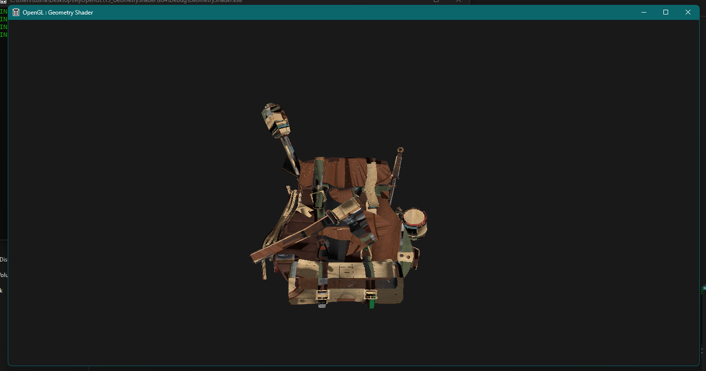
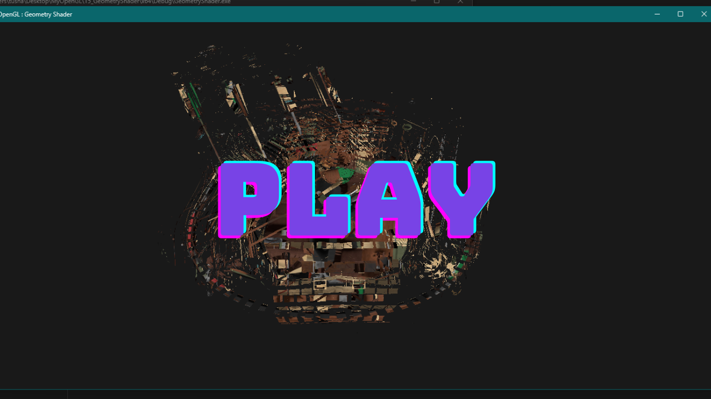

# OpenGL-GeometryShader

## Description

This repository demonstrates the implementation of Geometry Shaders in OpenGL using C++ and GLSL. Geometry shaders run after vertex shaders and before fragment shaders, allowing you to generate new primitives (points, lines, or triangles) from input primitives, enabling effects like mesh explosion, wireframe rendering, and more.

## Screenshots



## Video Demo

[](https://youtu.be/YSVAuS9mxgY)

## Folder Structure

*   `GeometryShader/x64/Debug`: Contains build files and output executables.
*   `resources`: Contains model assets used in the project.
*   `shaders`: Contains GLSL shader programs, including the geometry shader.
*   `x64/Debug`: Contains debug build output.

## Dependencies

Before building and running this project, you need to install the following dependencies:

*   **GLEW (OpenGL Extension Wrangler Library):** Download GLEW and add the `include` directory and library files (e.g., `glew32.lib`) to your system environment variables.
*   **GLM (OpenGL Mathematics):** Download GLM. GLM is a header-only library, so simply copy the `glm` directory into your project's include path.
*   **Assimp (Open Asset Importer Library):** Download Assimp and add the `include` directory and library files to your system environment variables.

**Note:** Adding GLEW and GLM to your system environment variables ensures that Visual Studio can find them during the build process. This typically involves adding paths to the `INCLUDE` and `LIB` environment variables.

## Build Instructions (Visual Studio 2022)

Follow these steps to build the project using Visual Studio 2022:

1.  **Clone the Repository:** Clone this repository to your local machine using the following command:
    ```bash
    git clone https://github.com/Tushar-Wagdare/OpenGL-GeometryShader.git
    ```
2.  **Open the Solution:** Open the `OGL.sln` file in Visual Studio 2022.
3.  **Build the Solution:** Go to `Build` -> `Build Solution` (or press `Ctrl+Shift+B`).
4.  **Ensure all dependencies are present:** Make sure all the dependencies are installed and placed in the system environment.
5.  **Run the Solution:** After building, run the solution.

## Usage

After successfully building the project, you can run the executable located in the `x64/Debug` directory. Explore the different effects achieved by the Geometry Shader and observe how it transforms the original geometry.
